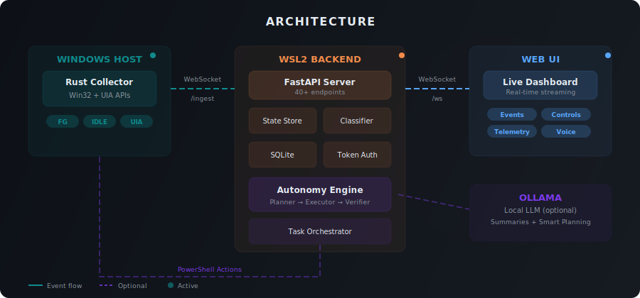

<p align="center">
  
</p>

<p align="center">
  <a href="#quickstart"><strong>Quickstart</strong></a> &nbsp;&middot;&nbsp;
  <a href="#architecture"><strong>Architecture</strong></a> &nbsp;&middot;&nbsp;
  <a href="#features"><strong>Features</strong></a> &nbsp;&middot;&nbsp;
  <a href="#api-reference"><strong>API</strong></a> &nbsp;&middot;&nbsp;
  <a href="#testing"><strong>Testing</strong></a>
</p>

<p align="center">
  
  
  
  
  
  
</p>

<p align="center">
  
  
  
  
  
</p>

---

An intelligent desktop assistant that **observes** your Windows activity in real time, **classifies** what you're doing, and can **autonomously execute** tasks like drafting emails, managing windows, and automating workflows &mdash; all running locally with zero cloud dependencies.

<p align="center">
  
</p>

---

## Architecture

<p align="center">
  
</p>

<table>
<tr>
<td width="33%">

### Rust Collector
Low-level Windows observer built in Rust (8 modules, 55 tests). Hooks into Win32 and UI Automation APIs to capture foreground window changes, idle/active transitions, recursive UIA element trees, and optional desktop screenshots. Ships events over WebSocket to the backend in real time.

</td>
<td width="34%">

### FastAPI Backend
Python backend running in WSL2 (125 unit tests + 8 integration tests). Manages state, persists to SQLite, classifies activity via rules or local LLM, orchestrates autonomous task execution with Playwright browser automation, and serves the web UI. 40+ REST endpoints and 2 WebSocket channels.

</td>
<td width="33%">

### Live Web UI
Real-time dashboard streaming desktop context over WebSocket. Event filters, category classification, autonomy controls, voice interface, Ollama integration panel, and telemetry journey console.

</td>
</tr>
</table>

---

## Features

<table>
<tr>
<td align="center" width="25%">
<br/>

<br/><br/>
<strong>Live Window Tracking</strong><br/>
<sub>Foreground changes, idle detection, recursive UIA tree capture, and desktop screenshots streamed in real time</sub>
<br/><br/>
</td>
<td align="center" width="25%">
<br/>

<br/><br/>
<strong>Activity Classification</strong><br/>
<sub>Auto-categorize into coding, docs, comms, web, terminal, meeting &mdash; rules or local LLM</sub>
<br/><br/>
</td>
<td align="center" width="25%">
<br/>

<br/><br/>
<strong>Task Execution</strong><br/>
<sub>Planner &rarr; Executor &rarr; Verifier loop with approval gates for irreversible actions</sub>
<br/><br/>
</td>
<td align="center" width="25%">
<br/>

<br/><br/>
<strong>Zero Cloud Dependencies</strong><br/>
<sub>Everything runs on your machine. No keystrokes, screenshots, or data leaves your network</sub>
<br/><br/>
</td>
</tr>
</table>

<details>
<summary><strong>More capabilities</strong></summary>
<br/>

| Capability | Description |
|---|---|
| **Voice Control** | Browser-native speech recognition and TTS with live transcript |
| **Ollama Integration** | Local LLM via `/api/chat` with vision, structured JSON output, and auto-fallback on model-not-found |
| **Multi-Model Support** | Per-role Ollama models (classifier, planner, executor) with runtime hot-swap |
| **Browser Automation** | Playwright executor via Chrome DevTools Protocol for navigate, click, fill, screenshot |
| **Screenshot Capture** | GDI-based desktop capture with JPEG encoding, ring buffer, and configurable downscaling |
| **Token Auth** | Opt-in Bearer token auth for all API endpoints (dev mode = no auth) |
| **SQLite Persistence** | Events, autonomy runs, and task records survive restarts with configurable retention |
| **Readiness Gates** | One-shot and matrix readiness checks for deployment validation |
| **UI Telemetry** | Full frontend journey telemetry with session artifacts and backend log correlation |
| **Runtime Logs** | In-memory log buffer with level/text/time filters and session correlation |
| **Ollama Model Switching** | Hot-swap between installed models at runtime, persisted across restarts |
| **Planner Modes** | `deterministic`, `auto`, or `ollama_required` &mdash; switchable at runtime |
| **PowerShell Executor** | Real Windows automation via PowerShell COM with retry and preflight checks |
| **Recursive UIA Trees** | Depth-limited UI Automation tree walker with pattern detection (Value, Toggle, Invoke) |

</details>

---

## Quickstart

### Backend (WSL2)

```bash
git clone https://github.com/nxtg-ai/DesktopAI.git
cd DesktopAI
python -m venv .venv && source .venv/bin/activate
pip install -r backend/requirements.txt

# Start the backend
make backend-dev
```

Open **http://localhost:8000** in your browser.

### Windows Collector

<details>
<summary><strong>Build & run instructions</strong></summary>

#### Install toolchain (WSL2)
```bash
sudo apt-get update && sudo apt-get install -y mingw-w64
rustup target add x86_64-pc-windows-gnu
```

#### Build
```bash
make collector-build
# Binary: collector/target/x86_64-pc-windows-gnu/release/desktopai-collector.exe
```

#### Run on Windows
```powershell
$env:BACKEND_WS_URL = "ws://localhost:8000/ingest"
$env:BACKEND_HTTP_URL = "http://localhost:8000/api/events"
$env:IDLE_ENABLED = "1"
$env:IDLE_THRESHOLD_MS = "60000"
$env:UIA_ENABLED = "0"
./desktopai-collector.exe
```

> **Note:** Windows &rarr; WSL2 `localhost` forwarding is typically enabled. If not, use the WSL2 VM IP from `wsl hostname -I`.

</details>

### Authentication (optional)

Set `API_TOKEN` to enforce Bearer token auth on all `/api/*` endpoints (except `/api/health`):

```bash
API_TOKEN=my-secret-token make backend-dev

# Requests now require the token:
curl -H "Authorization: Bearer my-secret-token" http://localhost:8000/api/state
```

If `API_TOKEN` is unset, all requests pass through (dev mode).

---

## API Reference

<details>
<summary><strong>40+ endpoints</strong> &mdash; click to expand</summary>
<br/>

| Method | Endpoint | Description |
|--------|----------|-------------|
| `GET` | `/api/health` | Health check (always public) |
| `GET` | `/api/selftest` | Backend self-test (DB, SQLite, config) |
| `GET` | `/api/state` | Current window state |
| `POST` | `/api/events` | Ingest event (HTTP) |
| `GET` | `/api/events?limit=N` | Recent events |
| `POST` | `/api/classify` | Classify an event payload |
| `GET` | `/api/collector` | Collector connection status |
| `GET` | `/api/executor` | Action executor runtime status |
| `GET` | `/api/executor/preflight` | Executor readiness checks |
| `GET` | `/api/readiness/status` | Consolidated readiness summary |
| `POST` | `/api/readiness/gate` | One-shot readiness gate |
| `POST` | `/api/readiness/matrix` | Multi-objective readiness matrix |
| | | |
| `POST` | `/api/tasks` | Create task objective |
| `GET` | `/api/tasks` | List tasks |
| `GET` | `/api/tasks/{id}` | Get task details |
| `POST` | `/api/tasks/{id}/plan` | Attach plan steps |
| `POST` | `/api/tasks/{id}/run` | Execute planned steps |
| `POST` | `/api/tasks/{id}/approve` | Approve irreversible step |
| `POST` | `/api/tasks/{id}/pause` | Pause task |
| `POST` | `/api/tasks/{id}/resume` | Resume task |
| `POST` | `/api/tasks/{id}/cancel` | Cancel task |
| | | |
| `POST` | `/api/autonomy/runs` | Start autonomous run |
| `GET` | `/api/autonomy/runs` | List runs |
| `GET` | `/api/autonomy/runs/{id}` | Get run state/log |
| `POST` | `/api/autonomy/runs/{id}/approve` | Approve next step |
| `POST` | `/api/autonomy/runs/{id}/cancel` | Cancel run |
| `GET` | `/api/autonomy/planner` | Planner mode status |
| `POST` | `/api/autonomy/planner` | Set planner mode |
| `DELETE` | `/api/autonomy/planner` | Reset to config default |
| | | |
| `GET` | `/api/ollama` | Ollama status + diagnostics |
| `GET` | `/api/ollama/models` | List installed models |
| `POST` | `/api/ollama/model` | Set runtime model override |
| `DELETE` | `/api/ollama/model` | Clear model override |
| `POST` | `/api/ollama/probe` | Real generate probe |
| `POST` | `/api/summarize` | Ollama context summary |
| | | |
| `POST` | `/api/ui-telemetry` | Ingest UI telemetry batch |
| `GET` | `/api/ui-telemetry` | List telemetry events |
| `GET` | `/api/ui-telemetry/sessions` | List sessions |
| `POST` | `/api/ui-telemetry/reset` | Clear telemetry buffer |
| `GET` | `/api/runtime-logs` | Runtime logs (filterable) |
| `GET` | `/api/runtime-logs/correlate` | Correlate logs to session |
| `POST` | `/api/runtime-logs/reset` | Clear log buffer |
| | | |
| `WS` | `/ingest` | Collector event stream |
| `WS` | `/ws` | UI real-time updates |

</details>

---

## Testing

```bash
# Backend (Python)
make backend-test              # 125 unit tests (excludes integration)
make backend-test-integration  # 8 real Ollama integration tests

# Rust Collector
cd collector && cargo test     # 55 unit tests (Linux-testable)

# UI (Playwright)
make ui-test                   # Browser smoke tests (headless)
make ui-test-headed            # Watch the browser journey
make ui-gate                   # Telemetry validation gate
```

<details>
<summary><strong>Playwright smoke coverage</strong></summary>
<br/>

The E2E suite validates the full user journey including:

- Page boot + live WebSocket connection
- Autonomy run start, approval, and cancel flows
- Real `/api/events` ingestion reflected in the UI
- Telemetry emission for streamed events
- Journey console session selection + rendered events
- Readiness status panel and gate/matrix execution
- Ollama diagnostics, model controls, and probe
- Planner mode selector with live runtime update
- Runtime log panel with filters, correlation, and clear
- Correlated log view pinning across polling

Artifacts are written to:
- `artifacts/ui/playwright/report/` &mdash; HTML report
- `artifacts/ui/playwright/test-results/` &mdash; traces, screenshots, video
- `artifacts/ui/telemetry/<session-id>.jsonl` &mdash; journey logs

</details>

---

## Configuration

<details>
<summary><strong>All environment variables</strong></summary>
<br/>

| Variable | Default | Description |
|----------|---------|-------------|
| `BACKEND_HOST` | `0.0.0.0` | Server bind address |
| `BACKEND_PORT` | `8000` | Server port |
| `API_TOKEN` | *(empty)* | Bearer token (empty = no auth) |
| `BACKEND_DB_PATH` | `backend/data/desktopai.db` | SQLite database path |
| `DB_RETENTION_DAYS` | `14` | Event age pruning |
| `DB_MAX_EVENTS` | `20000` | Max event rows |
| `DB_MAX_AUTONOMY_RUNS` | `2000` | Max autonomy run records |
| `DB_MAX_TASK_RECORDS` | `5000` | Max task records |
| `OLLAMA_URL` | `http://localhost:11434` | Ollama API URL |
| `OLLAMA_MODEL` | `llama3.1:8b` | Default Ollama model |
| `OLLAMA_CLASSIFIER_MODEL` | *(empty)* | Override model for activity classification |
| `OLLAMA_PLANNER_MODEL` | *(empty)* | Override model for autonomy planner |
| `OLLAMA_EXECUTOR_MODEL` | *(empty)* | Override model for task executor |
| `AUTONOMY_PLANNER_MODE` | `deterministic` | `deterministic` / `auto` / `ollama_required` |
| `CLASSIFIER_DEFAULT` | `docs` | Default activity category |
| `CLASSIFIER_USE_OLLAMA` | `0` | Enable Ollama classification fallback |
| `ACTION_EXECUTOR_MODE` | `auto` | `auto` / `windows` / `simulated` / `playwright` |
| `CDP_ENDPOINT` | `http://localhost:9222` | Chrome DevTools Protocol endpoint for Playwright |
| `ACTION_EXECUTOR_TIMEOUT_S` | `20` | PowerShell execution timeout |
| `ALLOWED_ORIGINS` | *(empty)* | CORS origins (comma-separated) |

See `.env.example` for the complete reference.

</details>

<details>
<summary><strong>Collector settings</strong></summary>
<br/>

| Variable | Default | Description |
|----------|---------|-------------|
| `BACKEND_WS_URL` | `ws://localhost:8000/ingest` | WebSocket endpoint |
| `BACKEND_HTTP_URL` | `http://localhost:8000/api/events` | HTTP fallback |
| `WS_RETRY_SECONDS` | `5` | Reconnect interval |
| `IDLE_ENABLED` | `1` | Enable idle/active events |
| `IDLE_THRESHOLD_MS` | `60000` | Idle timeout |
| `IDLE_POLL_MS` | `1000` | Idle polling interval |
| `UIA_ENABLED` | `0` | Enable UI Automation snapshots |
| `UIA_THROTTLE_MS` | `1000` | UIA throttle interval |
| `UIA_TEXT_MAX_CHARS` | `240` | Max UIA text capture length |
| `UIA_MAX_DEPTH` | `3` | Max recursive tree depth |
| `ENABLE_SCREENSHOT` | `0` | Enable desktop screenshot capture |
| `SCREENSHOT_MAX_WIDTH` | `1024` | Max screenshot width (px) |
| `SCREENSHOT_MAX_HEIGHT` | `768` | Max screenshot height (px) |
| `SCREENSHOT_QUALITY` | `85` | JPEG quality (0-100) |

</details>

---

## Development

```bash
make backend-dev               # Start dev server with reload
make backend-test              # Run unit tests (125 tests)
make backend-test-integration  # Run Ollama integration tests (8 tests)
make ui-test                   # Headless Playwright tests
make ui-test-headed       # Watch browser journey
make ui-test-live         # Tests against running backend
make ui-gate              # Telemetry validation gate
make ui-artifacts         # Quick artifact summary
make ui-sessions          # List telemetry sessions
make collector-build      # Build Windows collector
make skills-validate      # Validate skill fixtures
```

<details>
<summary><strong>TDD workflow</strong></summary>
<br/>

1. **Red** &mdash; Write/update a test and prove it fails for the expected reason
2. **Green** &mdash; Implement the smallest change to pass
3. **Refactor** &mdash; Clean up while keeping tests green
4. Run targeted tests first, then full suite + lint

</details>

<details>
<summary><strong>Pre-commit hooks</strong></summary>

```bash
pip install pre-commit
pre-commit install
```

</details>

---

## Privacy

DesktopAI is designed to be **local-first and privacy-preserving**:

- No keystrokes are captured
- Screenshots are **opt-in** (`ENABLE_SCREENSHOT=1`), JPEG-compressed, and downscaled &mdash; disabled by default
- No data leaves your network in the core path
- Ollama runs locally &mdash; no cloud LLM calls
- UIA snapshots are optional, throttled, depth-limited, and text-truncated
- The backend keeps a memory cache for fast UI updates and persists to local SQLite

---

<p align="center">
  <sub>Built with <a href="https://www.rust-lang.org/">Rust</a>, <a href="https://fastapi.tiangolo.com/">FastAPI</a>, and the belief that your desktop context should stay on your desktop.</sub>
</p>
